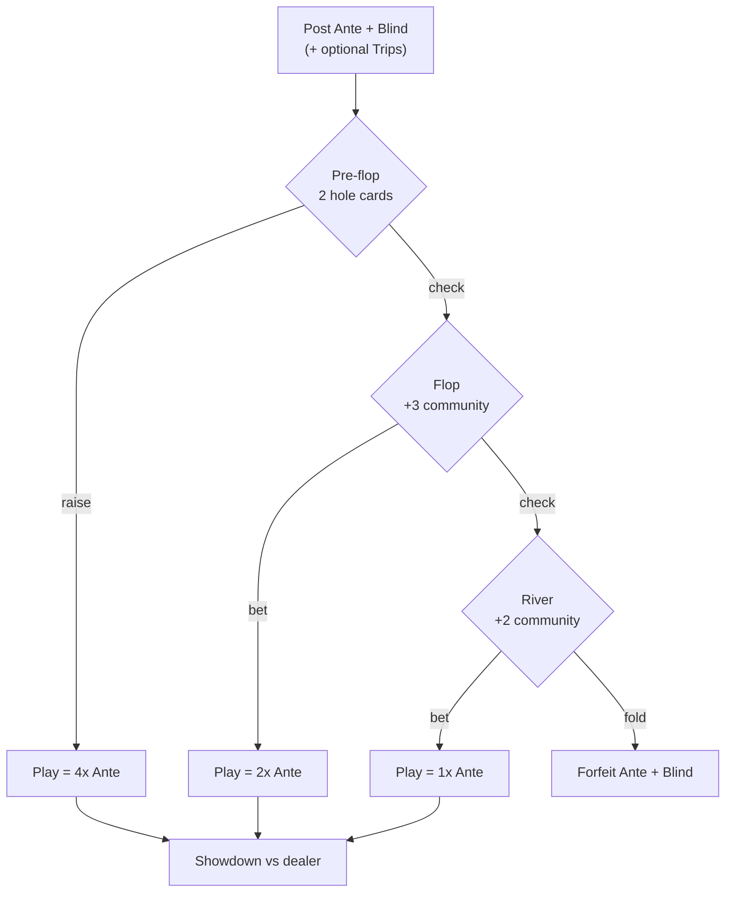
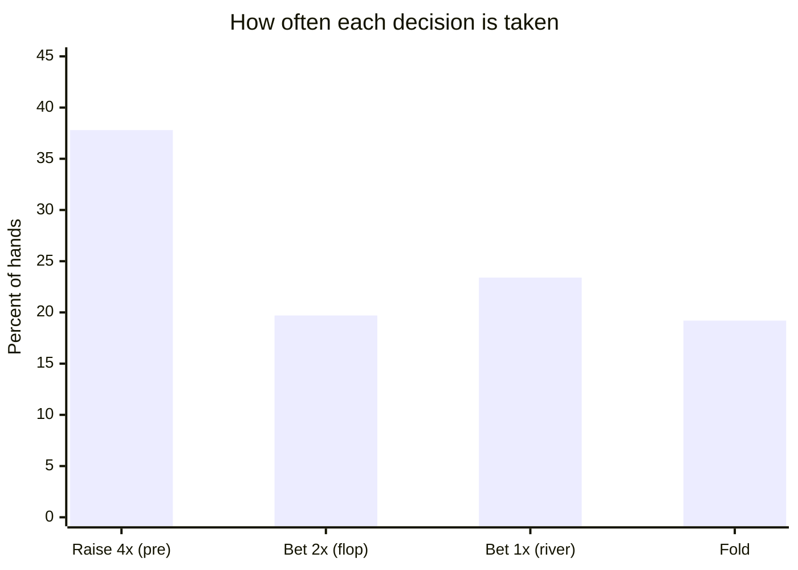
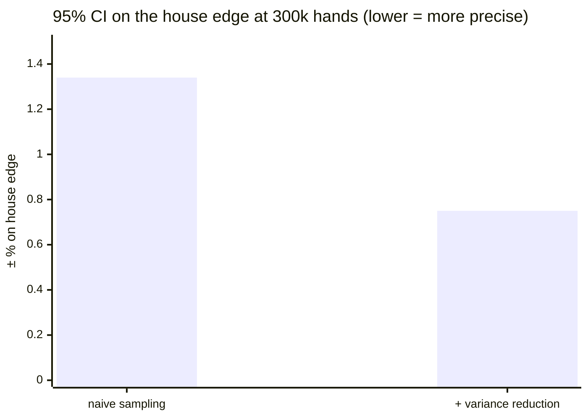

# 🃏 Ultimate Texas Hold'em — Monte Carlo EV Engine

A dependency-free Python engine that computes the exact math of **Ultimate Texas
Hold'em (UTH)**: the house edge under optimal strategy, the EV of every bet, the
variance a player faces, and — uniquely — a **dead-card-aware solver** that tells
you how knowing other players' cards changes the optimal play.

It is built as an **EV engine**, not a video game. The design goal is to get the
numbers *right* and *fast*, using exact enumeration and variance reduction
instead of brute-force sampling.

```text
$ python -m uth --hands 5000000 --no-trips
 House edge (Ante)   : +2.2418%  ± 0.19  (95% CI)
 Element of risk     : +0.5418%  (/ total wagered)
```

- ✅ **Pure standard library** — no NumPy, no dependencies, just `python -m uth`.
- ✅ **Exact, not just sampled** — each deal's EV is integrated over all 990
  possible dealer hands.
- ✅ **Variance-reduced** — analytical Trips + a royal-flush control variate make
  the edge converge in millions of hands instead of tens of millions.
- ✅ **Validated** — reproduces the published 2.185 %/0.53 % figures; 13 tests
  including a brute-force exactness check.

---

## Table of contents

- [The game](#the-game)
- [Optimal strategy](#optimal-strategy)
- [Results](#results)
- [Why it converges fast](#why-it-converges-fast-variance-reduction)
- [Dead-card-aware advisor](#dead-card-aware-advisor)
- [Usage](#usage)
- [Project layout](#project-layout)
- [Tests](#tests)

---

## The game

Each hand the player posts an **Ante** and a **Blind** (equal, mandatory) plus an
optional **Trips** side bet, then makes one **Play** bet whose size shrinks the
longer you wait to commit:



At showdown each side makes the best five-card hand from seven. The dealer
**qualifies** with a pair or better. Settlement:

| Bet | Win | Lose | Tie | Dealer doesn't qualify |
|-----|-----|------|-----|------------------------|
| **Play** | pays 1:1 | loses | push | resolved by the hand comparison |
| **Ante** | pays 1:1 | loses | push | **pushes** |
| **Blind** | pays the pay table | loses | push | resolved by the hand comparison |
| **Trips** | pays the Trips table on trips-or-better, regardless of the dealer or a fold | | | |

### Blind pay table

| Hand | Royal flush | Straight flush | Four of a kind | Full house | Flush | Straight | < Straight |
|------|:-----------:|:--------------:|:--------------:|:----------:|:-----:|:--------:|:----------:|
| Pays | **500:1** | 50:1 | 10:1 | 3:1 | 3:2 | 1:1 | push |

### Trips pay table (`pay_table_1`, default)

| Hand | Royal flush | Straight flush | Four of a kind | Full house | Flush | Straight | Three of a kind |
|------|:-----------:|:--------------:|:--------------:|:----------:|:-----:|:--------:|:---------------:|
| Pays | 50:1 | 40:1 | 30:1 | 8:1 | 7:1 | 4:1 | 3:1 |

---

## Optimal strategy

Pre-flop and flop decisions use the published Wizard of Odds basic-strategy
charts; the river decision is solved **exactly** by enumerating every possible
dealer holding.

**Pre-flop — raise 4× with:**

| Holding | Raise 4× when |
|---------|---------------|
| Pocket pair | 3-3 or higher |
| Any Ace | always |
| King-high | suited (any kicker) · offsuit kicker ≥ 5 |
| Queen-high | suited kicker ≥ 6 · offsuit kicker ≥ 8 |
| Jack-high | suited kicker ≥ 8 · offsuit kicker = 10 |

**Flop — bet 2× with:** two pair or better · a hidden pair (uses a hole card,
except a pair of deuces) · four to a flush including a hidden card ≥ 10.

**River — bet 1× vs fold:** enumerate all C(45, 2) = 990 possible dealer holdings
and bet whenever the EV of betting beats the −2 of folding. This is provably
optimal and replaces the chart's "21 outs" heuristic.

---

## Results

**Optimal play, no Trips — 5,000,000 hands, exact dealer integration:**

| Metric | This engine | Published |
|--------|:-----------:|:---------:|
| **House edge** (on the Ante) | **2.24 % ± 0.19** | 2.185 % |
| **Element of risk** (per total wagered) | **0.542 %** | ≈ 0.53 % |
| Average total wagered | 4.14 antes/hand | ≈ 4.15 |

> The engine's 2.24 % sits just above the textbook 2.185 % because it uses the
> *chart* for pre-flop/flop (a hair short of full computer-perfect play) with an
> *exact* river. Element of risk and average bet match the published values,
> cross-checking the evaluator, strategy, and settlement together.

### Where the edge comes from (expected net per bet, antes/hand)

```text
 Play   +0.4534  ┃██████████████████████████▶   (the bet you control — positive!)
 Ante   -0.1667  ◀██████████┃
 Blind  -0.3091  ◀██████████████████┃
 ────────────────────────────────────────────────
 Base   -0.0224  →  2.24% house edge on the Ante
 Trips  -0.0350      separate 1-unit side bet  →  3.50% of the Trips stake
```

The **Play** bet is the only one you size, and good strategy makes it strongly
+EV; the mandatory Ante and Blind are the house's structural edge.

### Decision frequencies under optimal play



### Side-bet house edges

| Bet | House edge | Basis |
|-----|:----------:|-------|
| Base game (Ante + Blind + Play) | **2.24 %** | of the Ante |
| Trips (`pay_table_1`) | **3.50 %** | of the Trips stake (exact, analytical) |

---

## Why it converges fast (variance reduction)

UTH has brutal per-hand variance: 4× swings, plus a **500:1 Blind royal** and
**50:1/40:1/30:1 Trips** that hit once in thousands of hands. Naively, a sample
that *hasn't yet hit a royal* over-estimates the house edge — so you'd need tens
of millions of hands to settle the number. Three exact, unbiased techniques fix
this:

| Technique | What it removes | Result |
|-----------|-----------------|--------|
| **Dealer integration** | all dealer-side variance — each deal's EV is computed over all 990 dealer holdings | exact per-deal mean |
| **Analytical Trips** | *all* Trips variance — its EV is closed-form from the 7-card hand frequencies | zero sampling for Trips |
| **Royal control variate** | the dominant 500:1 royal-flush spike (≈ 60 % of remaining variance), via the known-mean blind multiplier | β ≈ 1.03, as theory predicts |

The royal flush alone dominates the leftover variance — exactly the effect that
makes early samples read 3–10 %:

```text
 Blind variance contribution by hand (E[ev²]):
   Royal flush  500:1  ████████████████████████████████  8.08   ← dominates
   Str. flush    50:1  ███                                0.70
   Full house     3:1  █                                  0.23
   Quads         10:1  █                                  0.17
   Flush        3:2    ▏                                  0.07
```

Net effect on the 95 % confidence interval (same hand count):



At 300k hands (no Trips) variance reduction tightens the 95 % CI from ±1.34 % to
±0.75 % — roughly **3× fewer hands** for the same precision. With the Trips bet
the gap is far larger, since its 50:1 payouts are removed analytically rather
than sampled. The full 5M-hand run reaches **±0.19 %**.

> We also benchmarked the [`sval`](https://pypi.org/project/sval/) lookup
> evaluator as a faster backend: it installs but was only **1.43× faster** than
> the built-in evaluator (Python call overhead dominates the table lookup), so
> it isn't worth a NumPy/Numba dependency. Variance reduction is the real lever.

---

## Dead-card-aware advisor

UTH is purely you-vs-dealer, so at a full table the other players' hole cards are
**dead cards** — they cannot be in the dealer's hand or on the board. Knowing
them shrinks the dealer's draw pool and can shift a marginal decision.

```bash
# Pre-flop, holding As Kd, with five opponents' ten cards known
python -m uth.advise --hole "AsKd" --dead "2c 2h 7d 9s Jh Js 4c 4d Tc Th"

# Flop / river: also pass the board
python -m uth.advise --hole "AsKd" --board "Ah 7c 2d"        --dead "..."
python -m uth.advise --hole "AsKd" --board "Ah 7c 2d Ts 3h"  --dead "..."
```

It prints the optimal action **with** and **without** the dead-card knowledge:

- **River** — exact: enumerate every dealer holding from the reduced pool.
- **Flop** — exact: enumerate the two remaining board cards and the dealer.
- **Pre-flop** — Monte Carlo over boards (dealer integrated per board), with a CI.

### How much is the information worth?

At a 6-handed table you know **12 of the 52 cards** before the board comes —
your 2 plus the opponents' 10. That's ~20 % of the unseen deck removed from the
dealer's possible holdings. Measured as a paired comparison (same deals,
dead-aware vs dead-blind decision, both scored against the true reduced deck):

| Decision | Decisions that **flip** | EV added | Method |
|----------|:-----------------------:|:--------:|--------|
| **Pre-flop** | **9.3 %** of hands | **≈ +1.0 %** of the Ante | Monte Carlo, verified at 2 precisions |
| **River** | 4.5 % of river hands | +0.17 % of the Ante | exact enumeration |
| Flop | — | not yet measured (in between) | — |

```text
 Best edge achievable with full knowledge of all 6 hands
 ───────────────────────────────────────────────────────
   2.24%  base house edge (optimal play, no info)
 − ~1.0%  dead-card-aware PRE-FLOP decisions
 − 0.17%  dead-card-aware RIVER decisions
 − ?      flop (unmeasured)
 ───────────────────────────────────────────────────────
 ≈ ~1%    house edge  →  roughly halved, but STILL a LOSS
```

**Bottom line:** seeing every opponent's hand is worth a **lot more than
intuition suggests — it roughly halves the house edge** — yet it still does
**not** cross into player-advantage territory. The pre-flop value dominates
because that's where you have the least board information, so the 10 known cards
tip ~9 % of the raise/check calls, and a 4× raise leverages each one. (Seeing a
**dealer** hole card, by contrast, *does* flip the edge positive — that's the
classic UTH advantage play.)

### Worked example 1 — dead aces *kill* weak aces (raise → check)

Four players hold **A3 / A4 / A5 / A6 rainbow**, so all four aces are in play and
**no ace can ever come on the board.** The chart says "any ace → raise 4×"; the
solver disagrees for *every one of them*:

| Hand | Raise 4× EV | Check EV | Chart says | Optimal |
|------|:-----------:|:--------:|:----------:|:-------:|
| A3 | −0.830 | −0.620 | raise 4× | **CHECK** |
| A4 | −0.711 | −0.543 | raise 4× | **CHECK** |
| A5 | −0.631 | −0.515 | raise 4× | **CHECK** |
| A6 | −0.654 | −0.535 | raise 4× | **CHECK** |

A small ace's 4× value comes almost entirely from **flopping a pair of aces** —
impossible here, since there are no aces left in the deck.

```bash
$ python -m uth.advise --hole "Ad5s" --dead "Ah3c As4d Ac6h"
 Ignoring dead cards : RAISE 4X      # the static chart
 Using dead cards    : CHECK         # correct
 >> The dead cards CHANGE the optimal play: raise 4x -> check
```

### Worked example 2 — discounting big cards *promotes* the hands below them (check → raise)

The mirror image: strip the deck of high cards and the chart's marginal **checks**
turn into raises. The more big cards are dead, the stronger the effect.

**High-card hands** flip because removing the cards above them makes *their* card
the best high card:

| Hand | Big cards dead | Chart | Optimal | EV(raise 4×) |
|------|:--------------:|:-----:|:-------:|:------------:|
| K3o | A A A A | check | **RAISE** | −0.13 |
| K4o | A A A A | check | **RAISE** | +0.01 |
| Q7o | A A A A · K K K | check | **RAISE** | **+0.43** |
| Q5s | A A A A · K K K | check | **RAISE** | **+0.51** |
| J9o | A A A A · K K K · Q Q Q | check | **RAISE** | **+0.89** |

**Suited connectors** flip for a *different* reason — stripping A/K/Q guts the
dealer's high pairs/overcards, so T9s's middle pairs, straights and flushes win
far more often (and a pair of tens becomes near *top* pair):

| Hand | Big cards dead | Chart | Optimal | EV(raise 4×) |
|------|:--------------:|:-----:|:-------:|:------------:|
| T9s | A,K | check | **RAISE** | +0.84 |
| T9s | A,K,Q | check | **RAISE** | **+0.97** |
| T9o | A,K,Q | check | **RAISE** | +0.70 |
| 98s | A,K,Q | check | **RAISE** | +0.83 |
| **76s** | A,K,Q | check | **stays CHECK** | +0.18 *(check +0.31 wins)* |

There's a **floor**: 76s does *not* flip — removing big cards doesn't make 76s
itself strong, since the remaining J/T/9/8 still dominate it. So the rule the
engine reveals is: **discounting high cards promotes the hands that sit just
below them** (weak kings/queens, high connectors like T9s/JTs/98s) — not every
junk hand.

---

## Usage

No installation needed — run from the repo root:

```bash
python -m uth --hands 1000000                 # full game (Ante+Blind+Play+Trips)
python -m uth --hands 5000000 --no-trips       # base game only  -> ~2.24%
python -m uth --hands 200000 --mode play       # realized variance (bankroll swings)
python -m uth.advise --hole "AsKd" --dead "2c 2h 7d 9s Jh Js 4c 4d Tc Th"
```

Or install the console scripts:

```bash
pip install -e .
uth-sim --hands 2000000 --workers 8
uth-advise --hole "AsKd" --board "Ah 7c 2d Ts 3h" --dead "..."
```

### Simulator options

```
-n, --hands N        number of hands (default 100,000)
-s, --seed N         base RNG seed (default 0)
-w, --workers N      parallel processes (default: all CPUs)
    --no-trips       do not place the Trips side bet
    --trips-bet U    Trips bet size in ante units (default 1.0)
    --trips-table T  pay_table_1 | pay_table_5 | pay_table_6
    --mode ev|play   ev = exact dealer-integrated EV (default, fast convergence)
                     play = sample one dealer hand (realized variance)
    --quiet          hide the progress indicator
```

---

## Project layout

```text
uth/
  cards.py       card encoding (ints 0..51) + parsing
  evaluator.py   fast 5–7 card evaluator -> comparable integer score
  paytables.py   Blind + Trips tables; analytical Trips & control-variate means
  strategy.py    pre-flop / flop charts + exact river solver
  game.py        single-hand play, settlement, and exact per-hand EV
  simulator.py   Monte Carlo driver, parallelism, variance-reduced statistics
  advisor.py     dead-card-aware per-hand solvers (river / flop / pre-flop)
  cli.py         simulator CLI            (python -m uth)
  advise.py      advisor CLI              (python -m uth.advise)
tests/           evaluator, game/house-edge, and advisor tests
```

---

## Tests

```bash
pip install pytest
pytest -q          # 13 tests
```

Highlights: the evaluator is checked for self-consistency (direct 7-card score
== best of all 5-card subsets) and known rankings; `ev_for_deal` and the river
solver are checked against an **independent brute-force settlement** to machine
precision; and the simulated house edge is asserted statistically consistent
with the published figure.

---

## License

MIT.
